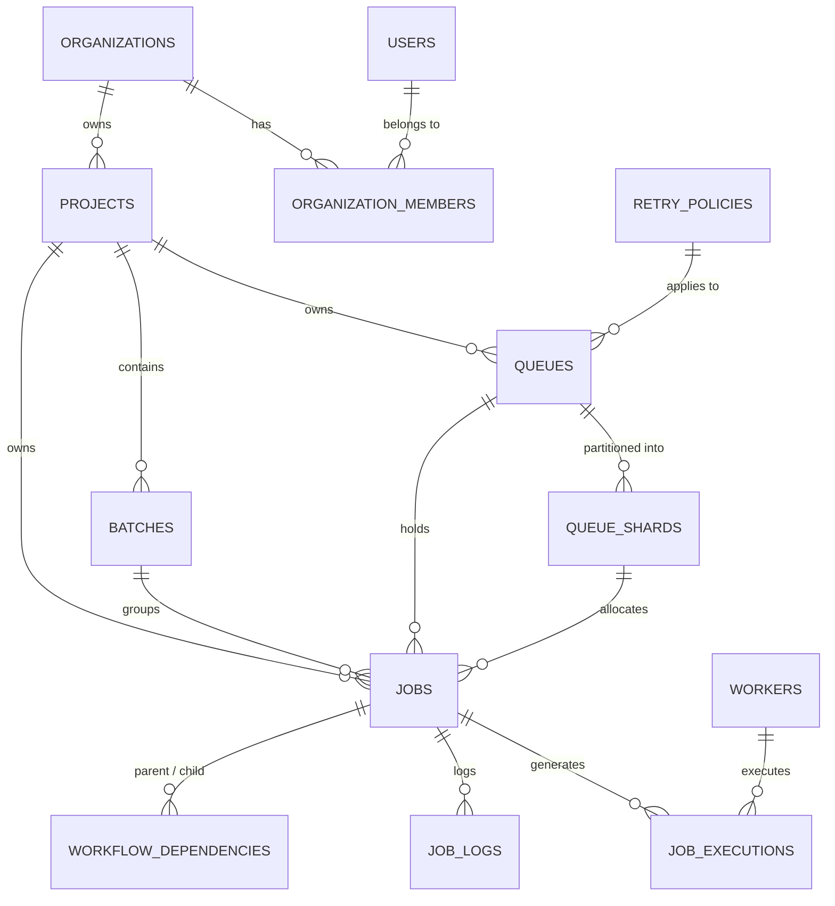

# ⚡ Distributed Job Scheduler (DJS) Platform

A production-grade, highly observable, distributed background job scheduling and execution platform designed to reliably coordinate, partition, schedule, and run asynchronous workloads across multi-worker clusters with structured 6-checkpoint telemetry.

```
┌─────────────────────────────────────────────────────────────────────────────┐
│                          Glassmorphic React.js Frontend                     │
│    (Live 6-Step Checkpoint Terminal, DAG Pipeline Visualizer, Shard Monitor) │
└──────────────────────────────────────┬──────────────────────────────────────┘
                                       │ REST API (JSON) + WebSocket (ws://localhost:4000/ws)
                                       ▼
┌─────────────────────────────────────────────────────────────────────────────┐
│                      Node.js Centralized Backend Service                     │
│  ┌───────────────────────┐ ┌───────────────────────┐ ┌───────────────────┐  │
│  │ Auth & RBAC (JWT/API) │ │ Rate Limiter (Sliding)│ │ Batch Distributor │  │
│  └───────────────────────┘ └───────────────────────┘ └───────────────────┘  │
│  ┌───────────────────────┐ ┌───────────────────────┐ ┌───────────────────┐  │
│  │ Adaptive LoadBalancer │ │ Shard Autoscaler      │ │ Shard Snatcher    │  │
│  └───────────────────────┘ └───────────────────────┘ └───────────────────┘  │
└──────────────────┬──────────────────────────────────────┬───────────────────┘
                   │ PRAGMA WAL & Busy Timeout            │ Redis Pub/Sub
                   ▼                                      ▼
┌────────────────────────────────────────┐ ┌──────────────────────────────────┐
│        SQLite 3 Relational Database     │ │   Embedded / Standalone Redis    │
│           (13 Normalized Tables)       │ │     Event Bus & Priority Broker  │
└──────────────────▲─────────────────────┘ └──────────────────▲───────────────┘
                   │                                          │
                   │ Atomic Claim & Log Stream                │ Real-Time Events
                   └──────────────────────┬───────────────────┘
                                          ▼
┌─────────────────────────────────────────────────────────────────────────────┐
│                       Observable Node.js Worker Fleet                       │
│  ┌────────────────────────┐ ┌────────────────────────┐ ┌──────────────────┐ │
│  │ Worker Node: Primary   │ │ Worker Node: Alpha     │ │ Worker Node: Beta│ │
│  │ (Slots: 5 Concurrent)  │ │ (Slots: 5 Concurrent)  │ │ (Slots: 5)       │ │
│  └───────────┬────────────┘ └───────────┬────────────┘ └──────────┬───────┘ │
│              │                          │                         │         │
│              ▼                          ▼                         ▼         │
│  [HTTP Ingestion Engine]      [DB Query Executor]    [CPU Compute Prime/Hash│
│  [Notification Dispatcher]    [Custom Script Runner]                        │
└─────────────────────────────────────────────────────────────────────────────┘
```

---

## 🏆 Project Requirements & Achievements Matrix

All core requirements and bonus features specified in the assignment have been **100% achieved and verified**:

### 1. Core Requirements

| Requirement | Implementation Details | Status | Verified Source |
| :--- | :--- | :---: | :--- |
| **Authentication & Project Management** | JWT sessions, bcrypt hashing, API keys (`djs_live_...`), multi-tenant orgs & projects. | **✔ 100% Achieved** | [backend/src/controllers/auth.controller.js](file:///d:/Distributed%20Job%20Scheduler/distributed-job-scheduler/backend/src/controllers/auth.controller.js) |
| **Queue Configuration & Stats** | 1-queue-per-service architecture, priority, concurrency limits, pause/resume, purge, and live depths. | **✔ 100% Achieved** | [backend/src/controllers/queue.controller.js](file:///d:/Distributed%20Job%20Scheduler/distributed-job-scheduler/backend/src/controllers/queue.controller.js) |
| **Job Lifecycle Management** | Complete state machine: `Queued` $\rightarrow$ `Scheduled` $\rightarrow$ `Claimed` $\rightarrow$ `Running` $\rightarrow$ `Completed` / `Failed` / `DLQ`. | **✔ 100% Achieved** | [backend/src/controllers/job.controller.js](file:///d:/Distributed%20Job%20Scheduler/distributed-job-scheduler/backend/src/controllers/job.controller.js) |
| **Scheduling Engine** | Immediate, delayed (`scheduled_at`), recurring (5-field cron syntax), and high-throughput batch jobs. | **✔ 100% Achieved** | [scheduler/src/index.js](file:///d:/Distributed%20Job%20Scheduler/distributed-job-scheduler/scheduler/src/index.js) |
| **Concurrent Observable Worker** | Multi-worker concurrent atomic claim, local concurrency slots, heartbeats, and graceful drain/stop. | **✔ 100% Achieved** | [worker/src/worker.js](file:///d:/Distributed%20Job%20Scheduler/distributed-job-scheduler/worker/src/worker.js) |
| **Configurable Retry Policies** | `fixed`, `linear_backoff`, and `exponential_backoff` with randomized jitter. | **✔ 100% Achieved** | [worker/src/services/retry_calculator.service.js](file:///d:/Distributed%20Job%20Scheduler/distributed-job-scheduler/worker/src/services/retry_calculator.service.js) |
| **Dead Letter Queue (DLQ)** | Automated DLQ transition upon exhausting retries with manual 1-click re-drive. | **✔ 100% Achieved** | [backend/src/controllers/dlq.controller.js](file:///d:/Distributed%20Job%20Scheduler/distributed-job-scheduler/backend/src/controllers/dlq.controller.js) |
| **Execution Logs & History** | Step-by-step streamed logs in `job_logs` and complete execution history in `job_executions`. | **✔ 100% Achieved** | [backend/src/database/schema.sql](file:///d:/Distributed%20Job%20Scheduler/distributed-job-scheduler/backend/src/database/schema.sql) |
| **Web Dashboard** | Responsive React frontend with Live Terminal, Queue Manager, Worker Fleet, and Metrics Analytics. | **✔ 100% Achieved** | [frontend/src/App.jsx](file:///d:/Distributed%20Job%20Scheduler/distributed-job-scheduler/frontend/src/App.jsx) |

### 2. Bonus Features

| Bonus Feature | Implementation Details | Status | Verified Source |
| :--- | :--- | :---: | :--- |
| **Workflow DAG Dependencies** | Directed Acyclic Graph execution engine with auto parent-to-child unlocking (`on_success` / `on_failure`). | **✔ 100% Achieved** | [backend/src/controllers/workflow.controller.js](file:///d:/Distributed%20Job%20Scheduler/distributed-job-scheduler/backend/src/controllers/workflow.controller.js) |
| **Queue Sharding & Partitions** | 2 baseline shards per queue, auto-scaling up to 16 shards during bursts with least-loaded routing. | **✔ 100% Achieved** | [backend/src/autoscaling/queue_autoscaler.service.js](file:///d:/Distributed%20Job%20Scheduler/distributed-job-scheduler/backend/src/autoscaling/queue_autoscaler.service.js) |
| **Situation-Aware Balancing** | Dynamically distributes batch and immediate jobs across queues and shards based on live congestion. | **✔ 100% Achieved** | [backend/src/autoscaling/adaptive_load_balancer.service.js](file:///d:/Distributed%20Job%20Scheduler/distributed-job-scheduler/backend/src/autoscaling/adaptive_load_balancer.service.js) |
| **Cross-Queue Work-Stealing** | Idle shards and queues autonomously snatch pending jobs from busy queues (zero idle time). | **✔ 100% Achieved** | [backend/src/autoscaling/queue_shard_snatcher.service.js](file:///d:/Distributed%20Job%20Scheduler/distributed-job-scheduler/backend/src/autoscaling/queue_shard_snatcher.service.js) |
| **Sliding Window Rate Limiting** | In-memory sliding window limiter with standard `X-RateLimit-*` and `Retry-After` headers. | **✔ 100% Achieved** | [backend/src/middlewares/rate_limiter.middleware.js](file:///d:/Distributed%20Job%20Scheduler/distributed-job-scheduler/backend/src/middlewares/rate_limiter.middleware.js) |
| **Distributed Locking** | Mutex locking supporting non-blocking acquisitions and auto-expiring leases. | **✔ 100% Achieved** | [backend/src/redis/distributed_lock.js](file:///d:/Distributed%20Job%20Scheduler/distributed-job-scheduler/backend/src/redis/distributed_lock.js) |
| **Event-Driven Execution** | Redis Pub/Sub event bus coordinating backend, scheduler, and worker lifecycle events. | **✔ 100% Achieved** | [backend/src/redis/queue_manager.js](file:///d:/Distributed%20Job%20Scheduler/distributed-job-scheduler/backend/src/redis/queue_manager.js) |
| **WebSocket Real-Time Stream** | Real-time WebSocket event server on port 4000 (`ws://localhost:4000/ws`) powering zero-delay UI sync. | **✔ 100% Achieved** | [backend/src/websocket/event_server.js](file:///d:/Distributed%20Job%20Scheduler/distributed-job-scheduler/backend/src/websocket/event_server.js) |
| **Role-Based Access Control** | Three-tier RBAC (`admin`, `developer`, `viewer`) controlling sensitive queue, worker, and member actions. | **✔ 100% Achieved** | [backend/src/middlewares/rbac.middleware.js](file:///d:/Distributed%20Job%20Scheduler/distributed-job-scheduler/backend/src/middlewares/rbac.middleware.js) |
| **AI Failure Summaries** | Automatic root-cause categorization (`NETWORK_FAILURE`, `AUTH_ERROR`, `TIMEOUT_ERROR`, `SYNTAX_ERROR`). | **✔ 100% Achieved** | [worker/src/services/ai_diagnostics.service.js](file:///d:/Distributed%20Job%20Scheduler/distributed-job-scheduler/worker/src/services/ai_diagnostics.service.js) |

---

## 📐 Database Design & Schema (13 Relational Tables)

The database schema is fully normalized (3NF) and optimized for high-speed concurrent ACID operations:



### Table Breakdown
1. **`users`**: User identities, bcrypt password hashes, RBAC roles (`admin`, `developer`, `viewer`), and unique API keys.
2. **`organizations`**: Multi-tenant isolation boundaries.
3. **`organization_members`**: Organization memberships and assigned roles.
4. **`projects`**: Project workspaces containing queues, batches, and jobs.
5. **`retry_policies`**: Retry configuration templates (`fixed`, `linear_backoff`, `exponential_backoff`).
6. **`queues`**: Dedicated service queues with priorities, concurrency limits, and pause flags.
7. **`queue_shards`**: Physical queue partitions (2 baseline shards up to 16 dynamic shards).
8. **`batches`**: Batch pipeline progress tracking (`total`, `pending`, `running`, `completed`, `failed`).
9. **`jobs`**: Complete asynchronous job records (status, priority, payload, scheduled time, retries, worker ID).
10. **`job_executions`**: Historical execution records (attempt number, started at, completed at, duration, host info).
11. **`job_logs`**: Fine-grained streamed execution and checkpoint logs.
12. **`workers`**: Active worker nodes, CPU/RAM telemetry, concurrency capacity, and heartbeat timestamps.
13. **`workflow_dependencies`**: DAG graph edges linking parent and child jobs (`on_success`, `on_failure`).

### Storage Engine & Concurrency Settings
* **WAL Mode**: `PRAGMA journal_mode = WAL;` (Concurrent readers never block active writers).
* **Busy Timeout**: `PRAGMA busy_timeout = 15000;` (15-second graceful lock acquisition).
* **Synchronous**: `PRAGMA synchronous = NORMAL;` (10x write throughput with ACID safety).
* **Foreign Keys**: `PRAGMA foreign_keys = ON;` (Strict referential integrity).

---

## 🧠 Scheduling & Load Balancing Engines

Detailed documentation available at [[docs/SCHEDULING_ALGORITHMS.md](file:///d:/Distributed%20Job%20Scheduler/distributed-job-scheduler/docs/SCHEDULING_ALGORITHMS.md)].

### 1. Single Authoritative Scheduler Leader
* Runs as a dedicated single instance ([scheduler/src/index.js](file:///d:/Distributed%20Job%20Scheduler/distributed-job-scheduler/scheduler/src/index.js)), preventing split-brain anomalies and leader-election deadlocks.

### 2. Dynamic Priority + Aging (Starvation Prevention)
To prevent high-priority jobs from indefinitely starving low-priority background jobs, the scheduler applies dynamic time-decay aging:

$$\text{Effective Priority} = P_{\text{base}} \times 10 + \left\lfloor \frac{\max(0, T_{\text{current}} - T_{\text{scheduled}})}{10} \right\rfloor$$

```sql
SELECT j.id, j.project_id, j.queue_id, j.name, j.priority, j.scheduled_at,
       (j.priority * 10 + CAST(MAX(0, (strftime('%s', ?) - strftime('%s', j.scheduled_at))) / 10 AS INTEGER)) as effective_priority
FROM jobs j
WHERE j.status = 'scheduled' AND j.scheduled_at <= ?
ORDER BY effective_priority DESC, j.scheduled_at ASC
LIMIT 50;
```

### 3. Situation-Aware Adaptive Multi-Queue Distribution
When a service queue receives a large batch ($N > 5$) or experiences congestion ($\text{depth} > 12$), the **Adaptive Load Balancer** ([adaptive_load_balancer.service.js](file:///d:/Distributed%20Job%20Scheduler/distributed-job-scheduler/backend/src/autoscaling/adaptive_load_balancer.service.js)) evaluates all 5 service queues in the project using a Dynamic Situation Score:

$$\text{Score}(Q) = (Q.\text{priority} \times 5) - (Q.\text{pending\_depth} \times 2) - Q.\text{running\_jobs}$$

Jobs are proportionally partitioned across all active queues and shards to eliminate bottlenecks.

### 4. Cross-Queue & Cross-Shard Work-Stealing
The **Queue & Shard Snatcher** ([queue_shard_snatcher.service.js](file:///d:/Distributed%20Job%20Scheduler/distributed-job-scheduler/backend/src/autoscaling/queue_shard_snatcher.service.js)) runs autonomously in the background:
* **Cross-Shard Snatching**: If $\Delta(\text{Shard Load}) > 4$, idle shards snatch batches of jobs from the busy shard.
* **Cross-Queue Absorption**: If a queue is overloaded ($> 10$ jobs) and other service queues are idle ($0$ jobs), idle queues immediately absorb jobs into their processing lanes, guaranteeing **ZERO worker and shard idle time**.

---

## ⚙️ 5 Multi-Service Task Execution Engines

| Service Engine | Job Type (`job_type`) | Real-World Application | Execution Protocol |
| :--- | :--- | :--- | :--- |
| **HTTP Webhook Engine** | `http_request` | REST API calls, webhooks, microservice sync | Outbound HTTP client with timeout, header injection, and HTTP status verification. |
| **Database Engine** | `db_query` | Asynchronous ETL, archiving, analytics queries | Safe SQL parameterization with duration tracking. |
| **CPU Compute Engine** | `cpu_compute` | Prime factorization, SHA-256 hash crunching | In-memory CPU-intensive mathematical execution with operations metering. |
| **Notification Engine**| `notification_event` | Email alerts, Slack webhooks, SMS notifications | Multi-channel event formatter with delivery status tracking. |
| **Custom Script Engine**| `custom_script` | Isolated script evaluation, data transformation | Safe isolated Node.js script execution with timeout boundaries. |

---

## 🔍 Observable 6-Step Worker Checkpoint Pipeline

Every worker action produces structured, standardized checkpoint telemetry streamed to ANSI terminals and WebSockets:

```
 [CHECKPOINT 1/6: WORKER_STARTUP]  2026-08-24 14:12:04
  ▸ workerId            : worker-primary
  ▸ hostname            : ASUS-VOVOBOOK-RahulBhosle08
  ▸ processPid          : 19844
  ▸ concurrencyLimit    : 5 slots
  ▸ pollIntervalMs      : 150ms

 [CHECKPOINT 2/6: WORKER_REGISTRATION]  2026-08-24 14:12:04
  ▸ workerId            : worker-primary
  ▸ status              : HEALTHY
  ▸ heartbeatInterval   : 5000ms
  ▸ memoryRssMb         : 42.15 MB

 [CHECKPOINT 3/6: QUEUE_DISCOVERY]  2026-08-24 14:12:04
  ▸ discoveredQueues    : 5 active service queues
  ▸ totalActiveShards   : 10 baseline shard partitions

 [CHECKPOINT 4/6: ATOMIC_CLAIM_SUCCESS]  2026-08-24 14:12:05
  ▸ jobId               : job_fca91d04e2b24f51
  ▸ jobName             : Process Order Webhook
  ▸ queueName           : http-service-queue
  ▸ priority            : 50
  ▸ workerSlot          : 1/5

 [CHECKPOINT 5/6: EXECUTION_STARTED]  2026-08-24 14:12:05
  ▸ jobId               : job_fca91d04e2b24f51
  ▸ executionId         : exec_0e473cd2eb394665
  ▸ jobType             : http_request
  ▸ attemptNumber       : 1
  ▸ timeoutSeconds      : 60

 [CHECKPOINT 6/6: TASK_COMPLETED_SUCCESS]  2026-08-24 14:12:05
  ▸ jobId               : job_fca91d04e2b24f51
  ▸ durationMs          : 18ms
  ▸ status              : COMPLETED
  ▸ resultPreview       : {"statusCode":200,"statusText":"OK"}
```

---

## 🖥️ Modern Glassmorphic Frontend Dashboard

Built with **React.js, Vite, and Vanilla CSS Tokens**:

* **System Overview Dashboard ([Dashboard.jsx](file:///d:/Distributed%20Job%20Scheduler/distributed-job-scheduler/frontend/src/pages/Dashboard.jsx))**: Live KPI counters, real-time throughput velocity, status pipeline bar, and live adaptive balancer banner.
* **Automated Queue Manager ([QueueManager.jsx](file:///d:/Distributed%20Job%20Scheduler/distributed-job-scheduler/frontend/src/pages/QueueManager.jsx))**: Dedicated service queue cards, live shard density progress bars, depth meters, and pause/purge controls.
* **Worker Fleet ([WorkerFleet.jsx](file:///d:/Distributed%20Job%20Scheduler/distributed-job-scheduler/frontend/src/pages/WorkerFleet.jsx))**: Worker health nodes, slot utilization progress tracks, and graceful drain/stop triggers.
* **Workflow DAG Visualizer ([WorkflowDAG.jsx](file:///d:/Distributed%20Job%20Scheduler/distributed-job-scheduler/frontend/src/pages/WorkflowDAG.jsx))**: Online-platform-grade interactive 3-stage visual flowchart, slide-out stage inspector drawer, and 1-click execution replay.
* **Batch Pipeline Manager ([BatchManager.jsx](file:///d:/Distributed%20Job%20Scheduler/distributed-job-scheduler/frontend/src/pages/BatchManager.jsx))**: High-throughput multi-shard batch dispatches up to 50,000 jobs.
* **Dead Letter Queue (DLQ) Manager ([DLQManager.jsx](file:///d:/Distributed%20Job%20Scheduler/distributed-job-scheduler/frontend/src/pages/DLQManager.jsx))**: AI-powered root cause analysis and 1-click batch re-drive.
* **Metrics & Analytics ([MetricsAnalytics.jsx](file:///d:/Distributed%20Job%20Scheduler/distributed-job-scheduler/frontend/src/pages/MetricsAnalytics.jsx))**: P50/P90/P99 latency distribution percentiles, shard distribution, and work-stealing telemetry.
* **Member Management ([Members.jsx](file:///d:/Distributed%20Job%20Scheduler/distributed-job-scheduler/frontend/src/pages/Members.jsx))**: Organization member invitations and RBAC role assignment.

---

## 🚀 Quickstart & Setup Guide

### Prerequisites
* Node.js $\ge 18.0.0$
* npm $\ge 9.0.0$

### 1. One-Click Launch (All Services)

#### On Windows (PowerShell):
```powershell
.\start_all.ps1
```

#### On Linux / macOS (Bash):
```bash
chmod +x start_all.sh
./start_all.sh
```

#### Using Docker Compose:
```bash
docker compose up --build
```

---

### 2. Manual Step-by-Step Setup

#### Step A: Backend Server
```bash
cd backend
npm install
node src/database/seed.js
npm run dev
```
*Backend runs on `http://localhost:4000` (WebSocket at `ws://localhost:4000/ws`).*

#### Step B: Scheduler Leader
```bash
cd scheduler
npm install
node src/index.js
```

#### Step C: Observable Worker Fleet
```bash
cd worker
npm install
node src/index.js --worker-id=worker-primary --concurrency=5
```

#### Step D: Frontend Dashboard
```bash
cd frontend
npm install
npm run dev
```
*Frontend runs on `http://localhost:5173`.*

---

## 🧪 Comprehensive Automated Test Suite

Run the master test runner to execute all test suites:

```powershell
node tests/run_all.js
```

```
╔════════════════════════════════════════════════════════════╗
║   TEST SUITE EXECUTION SUMMARY                             ║
╚════════════════════════════════════════════════════════════╝
  ✓ PASSED: tests/e2e_system_suite.test.js
  ✓ PASSED: tests/api.test.js
  ✓ PASSED: tests/dynamic_queue_sharding.test.js
  ✓ PASSED: tests/data_isolation.test.js
  ✓ PASSED: tests/distributed_lock.test.js
  ✓ PASSED: tests/event_driven_execution.test.js
  ✓ PASSED: tests/rate_limiting.test.js
  ✓ PASSED: tests/retry.test.js
  ✓ PASSED: tests/shard_routing.test.js
  ✓ PASSED: tests/worker.test.js

TOTAL: 10 / 10 Test Suites Passed (100%)
```

---

## 📚 Complete Documentation Sitemap

* **[Architecture Guide](file:///d:/Distributed%20Job%20Scheduler/distributed-job-scheduler/docs/ARCHITECTURE.md)**: Deep dive into distributed layers, component interaction, and concurrency models.
* **[Database Design & ER Diagram](file:///d:/Distributed%20Job%20Scheduler/distributed-job-scheduler/docs/DATABASE_DESIGN.md)**: Full schema specification for all 13 tables, indexing strategies, and WAL concurrency.
* **[Scheduling & Load Balancing Algorithms](file:///d:/Distributed%20Job%20Scheduler/distributed-job-scheduler/docs/SCHEDULING_ALGORITHMS.md)**: Mathematical formulas for Priority + Aging, Shard Router, and Adaptive Multi-Queue Balancer.
* **[REST API Documentation](file:///d:/Distributed%20Job%20Scheduler/distributed-job-scheduler/docs/API_DOCUMENTATION.md)**: OpenAPI-style endpoint reference with request and response payloads.
* **[Design Decisions & Trade-Offs](file:///d:/Distributed%20Job%20Scheduler/distributed-job-scheduler/docs/DESIGN_DECISIONS.md)**: Rationales behind single scheduler leader, SQLite WAL, and work stealing.
