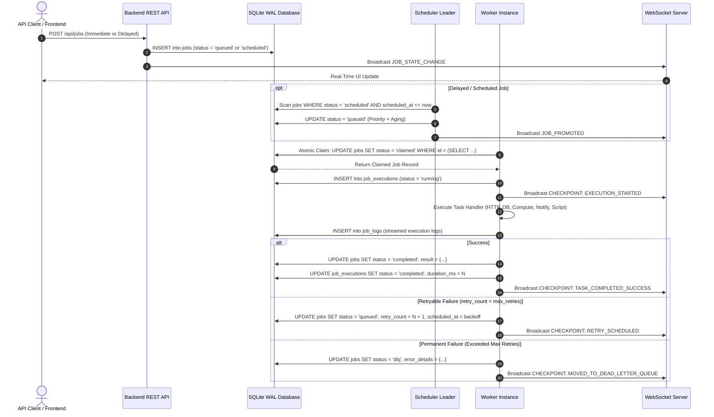

# Distributed Job Scheduler — System Architecture & Component Interactions

This document details the multi-tier distributed architecture, concurrency models, fault-tolerance mechanisms, and execution flows of the **Distributed Job Scheduler (DJS)** platform.

---

## 1. High-Level Architecture Diagram

```
┌─────────────────────────────────────────────────────────────────────────────┐
│                          Glassmorphic React.js Frontend                     │
│    (Live 6-Step Checkpoint Terminal, DAG Pipeline Visualizer, Shard Monitor) │
└──────────────────────────────────────┬──────────────────────────────────────┘
                                       │ REST API (JSON) + WebSocket (ws://localhost:4000/ws)
                                       ▼
┌─────────────────────────────────────────────────────────────────────────────┐
│                      Node.js Centralized Backend Service                     │
│  ┌───────────────────────┐ ┌───────────────────────┐ ┌───────────────────┐  │
│  │ Auth & RBAC (JWT/API) │ │ Rate Limiter (Sliding)│ │ Batch Distributor │  │
│  └───────────────────────┘ └───────────────────────┘ └───────────────────┘  │
│  ┌───────────────────────┐ ┌───────────────────────┐ ┌───────────────────┐  │
│  │ Adaptive LoadBalancer │ │ Shard Autoscaler      │ │ Shard Snatcher    │  │
│  └───────────────────────┘ └───────────────────────┘ └───────────────────┘  │
└──────────────────┬──────────────────────────────────────┬───────────────────┘
                   │ PRAGMA WAL & Busy Timeout            │ Redis Pub/Sub
                   ▼                                      ▼
┌────────────────────────────────────────┐ ┌──────────────────────────────────┐
│        SQLite 3 Relational Database     │ │   Embedded / Standalone Redis    │
│           (13 Normalized Tables)       │ │     Event Bus & Priority Broker  │
└──────────────────▲─────────────────────┘ └──────────────────▲───────────────┘
                   │                                          │
                   │ Atomic Claim & Log Stream                │ Real-Time Events
                   └──────────────────────┬───────────────────┘
                                          ▼
┌─────────────────────────────────────────────────────────────────────────────┐
│                       Observable Node.js Worker Fleet                       │
│  ┌────────────────────────┐ ┌────────────────────────┐ ┌──────────────────┐ │
│  │ Worker Node: Primary   │ │ Worker Node: Alpha     │ │ Worker Node: Beta│ │
│  │ (Slots: 5 Concurrent)  │ │ (Slots: 5 Concurrent)  │ │ (Slots: 5)       │ │
│  └───────────┬────────────┘ └───────────┬────────────┘ └──────────┬───────┘ │
│              │                          │                         │         │
│              ▼                          ▼                         ▼         │
│  [HTTP Ingestion Engine]      [DB Query Executor]    [CPU Compute Prime/Hash│
│  [Notification Dispatcher]    [Custom Script Runner]                        │
└─────────────────────────────────────────────────────────────────────────────┘
```

---

## 2. Core Subsystems

### 2.1 Single Authoritative Scheduler Leader ([scheduler/src/index.js](file:///d:/Distributed%20Job%20Scheduler/distributed-job-scheduler/scheduler/src/index.js))
* **Responsibility**: Time-based promotions, dynamic priority aging, 5-field cron parsing, and dead-worker job reclamation.
* **Why Single Authoritative Instance?**
  * Avoids split-brain anomalies and leader-election deadlocks.
  * Deterministically locks and promotes ready records in SQLite using serialized transactions.
* **Core Loops**:
  1. *Delayed Promotion Loop (1,000ms)*: Computes effective priority ($P_{\text{base}} \times 10 + \lfloor T_{\text{wait}}/10 \rfloor$) and updates status `scheduled` $\rightarrow$ `queued`.
  2. *Cron Evaluation Loop (5,000ms)*: Calculates next ISO timestamp using `cron-parser` and dispatches new job instances upon trigger.
  3. *Dead Worker Reaper Loop (10,000ms)*: Identifies workers with heartbeats older than 30 seconds, marks them `dead`, and automatically re-queues their in-flight jobs.

---

### 2.2 Situation-Aware Adaptive Load Balancer ([adaptive_load_balancer.service.js](file:///d:/Distributed%20Job%20Scheduler/distributed-job-scheduler/backend/src/autoscaling/adaptive_load_balancer.service.js))
* Evaluates live backlogs across all 5 dedicated service queues (`http`, `db`, `compute`, `notification`, `script`).
* If a single queue receives an influx of jobs or becomes congested ($\text{depth} > 12$), the load balancer proportionally divides and interleaves jobs across alternative queues and shards with available capacity.

---

### 2.3 Observable Worker Fleet ([worker/src/worker.js](file:///d:/Distributed%20Job%20Scheduler/distributed-job-scheduler/worker/src/worker.js))
* **Multi-Concurrency Slot Engine**: Each worker maintains a local semaphore (`concurrencyLimit`, default 5).
* **6-Checkpoint Observability Pipeline**:
  ```
  [CHECKPOINT 1/6: WORKER_STARTUP]      -> Initializes process, registers PID and hostname
  [CHECKPOINT 2/6: WORKER_REGISTRATION] -> Emits periodic heartbeat with CPU% and RSS memory
  [CHECKPOINT 3/6: QUEUE_DISCOVERY]     -> Identifies active service queues & shard partitions
  [CHECKPOINT 4/6: ATOMIC_CLAIM_SUCCESS]-> Claims highest priority job using atomic UPDATE
  [CHECKPOINT 5/6: EXECUTION_STARTED]   -> Spawns service handler & streams logs to database
  [CHECKPOINT 6/6: TASK_COMPLETED]      -> Records execution duration, results preview, or DLQ
  ```

---

## 3. The 5 Multi-Service Task Execution Engines

| Service Engine | Job Type (`job_type`) | Real-World Application | Execution Protocol |
| :--- | :--- | :--- | :--- |
| **HTTP Webhook Engine** | `http_request` | REST API calls, webhooks, microservice sync | Outbound HTTP client with timeout, header injection, and HTTP status verification. |
| **Database Engine** | `db_query` | Asynchronous ETL, archiving, analytics queries | Safe SQL parameterization with duration tracking. |
| **CPU Compute Engine** | `cpu_compute` | Prime factorization, SHA-256 hash crunching | In-memory CPU-intensive mathematical execution with operations metering. |
| **Notification Engine**| `notification_event` | Email alerts, Slack webhooks, SMS notifications | Multi-channel event formatter with delivery status tracking. |
| **Custom Script Engine**| `custom_script` | Isolated script evaluation, data transformation | Safe isolated Node.js script execution with timeout boundaries. |

---

## 4. End-to-End Execution Flow


