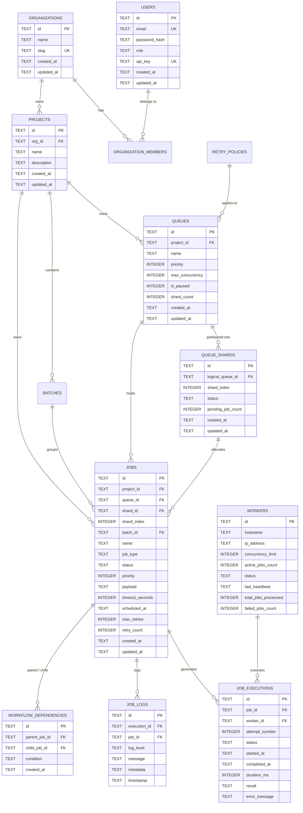

# Distributed Job Scheduler — Database Design & Relational Schema

This document specifies the database architecture, schema definitions, relational constraints, entity-relationship diagrams, indexing strategies, and performance optimizations of the **Distributed Job Scheduler (DJS)** platform.

---

## 1. Entity Relationship (ER) Diagram



---

## 2. Comprehensive Relational Schema Specification

### 2.1 Table: `users`
Represents platform administrators, operators, and developers with role-based access control (RBAC).

| Column | Type | Constraints | Description |
| :--- | :--- | :--- | :--- |
| `id` | `TEXT` | `PRIMARY KEY` | UUIDv4 identifier. |
| `email` | `TEXT` | `UNIQUE NOT NULL` | Login email address. |
| `password_hash` | `TEXT` | `NOT NULL` | Bcrypt-hashed password (cost factor 10). |
| `role` | `TEXT` | `CHECK(role IN ('admin', 'developer', 'viewer'))` | RBAC role level. |
| `api_key` | `TEXT` | `UNIQUE NOT NULL` | Programmatic access token (`djs_live_...`). |
| `created_at` | `TEXT` | `NOT NULL` | ISO 8601 UTC creation timestamp. |
| `updated_at` | `TEXT` | `NOT NULL` | ISO 8601 UTC update timestamp. |

---

### 2.2 Table: `organizations` & `organization_members`
Multi-tenant isolation boundaries. Projects and resources belong strictly to organizations.

| Column | Type | Constraints | Description |
| :--- | :--- | :--- | :--- |
| `id` | `TEXT` | `PRIMARY KEY` | UUIDv4 identifier. |
| `name` | `TEXT` | `NOT NULL` | Organization legal name. |
| `slug` | `TEXT` | `UNIQUE NOT NULL` | URL-safe slug identifier. |
| `created_at` | `TEXT` | `NOT NULL` | Creation timestamp. |

**`organization_members`**:
* `user_id` $\rightarrow$ `FOREIGN KEY (user_id) REFERENCES users(id) ON DELETE CASCADE`
* `org_id` $\rightarrow$ `FOREIGN KEY (org_id) REFERENCES organizations(id) ON DELETE CASCADE`
* Composite Primary Key: `PRIMARY KEY (user_id, org_id)`

---

### 2.3 Table: `projects`
Workspaces housing dedicated service queues, job batches, and DAG pipelines.

| Column | Type | Constraints | Description |
| :--- | :--- | :--- | :--- |
| `id` | `TEXT` | `PRIMARY KEY` | UUIDv4 project identifier. |
| `org_id` | `TEXT` | `FOREIGN KEY REFERENCES organizations(id) ON DELETE CASCADE` | Parent organization. |
| `name` | `TEXT` | `NOT NULL` | Project name. |
| `description` | `TEXT` | `NULLABLE` | Human-readable description. |

---

### 2.4 Table: `queues` & `queue_shards`
Represents logical service queues and their underlying physical shard partitions.

**`queues` Table**:
* `id`: `TEXT PRIMARY KEY`
* `project_id`: `TEXT REFERENCES projects(id) ON DELETE CASCADE`
* `name`: `TEXT NOT NULL` (e.g. `http-service-queue`, `compute-service-queue`)
* `priority`: `INTEGER DEFAULT 10`
* `max_concurrency`: `INTEGER DEFAULT 5`
* `is_paused`: `INTEGER DEFAULT 0 CHECK(is_paused IN (0, 1))`
* `min_shards`: `INTEGER DEFAULT 2`
* `max_shards`: `INTEGER DEFAULT 16`
* `shard_count`: `INTEGER DEFAULT 2`

**`queue_shards` Table**:
* `id`: `TEXT PRIMARY KEY`
* `logical_queue_id`: `TEXT REFERENCES queues(id) ON DELETE CASCADE`
* `shard_index`: `INTEGER NOT NULL` (0, 1, 2, ... 15)
* `status`: `TEXT CHECK(status IN ('active', 'draining', 'inactive'))`
* `pending_job_count`: `INTEGER DEFAULT 0`
* `UNIQUE (logical_queue_id, shard_index)`

---

### 2.5 Table: `jobs`
The core asynchronous workload record tracking complete lifecycle state.

| Column | Type | Constraints | Description |
| :--- | :--- | :--- | :--- |
| `id` | `TEXT` | `PRIMARY KEY` | UUIDv4 job identifier. |
| `project_id` | `TEXT` | `REFERENCES projects(id) ON DELETE CASCADE` | Scoped project. |
| `queue_id` | `TEXT` | `REFERENCES queues(id) ON DELETE CASCADE` | Assigned service queue. |
| `shard_id` | `TEXT` | `REFERENCES queue_shards(id) ON DELETE SET NULL` | Target shard partition. |
| `shard_index` | `INTEGER` | `DEFAULT 0` | Shard partition number (0–15). |
| `batch_id` | `TEXT` | `REFERENCES batches(id) ON DELETE SET NULL` | Optional batch group. |
| `worker_id` | `TEXT` | `REFERENCES workers(id) ON DELETE SET NULL` | Current/last worker node. |
| `name` | `TEXT` | `NOT NULL` | Job descriptive title. |
| `job_type` | `TEXT` | `CHECK(job_type IN ('http_request', 'db_query', 'cpu_compute', 'notification_event', 'custom_script'))` | Task engine handler. |
| `status` | `TEXT` | `CHECK(status IN ('queued', 'scheduled', 'claimed', 'running', 'completed', 'failed', 'dlq', 'cancelled'))` | Complete lifecycle state. |
| `priority` | `INTEGER` | `DEFAULT 10 CHECK(priority BETWEEN 1 AND 100)` | Base execution priority. |
| `payload` | `TEXT` | `NOT NULL` | JSON execution parameters. |
| `timeout_seconds`| `INTEGER` | `DEFAULT 60` | Execution timeout boundary. |
| `scheduled_at` | `TEXT` | `NOT NULL` | Time scheduled for execution. |
| `max_retries` | `INTEGER` | `DEFAULT 3` | Maximum retry attempts. |
| `retry_count` | `INTEGER` | `DEFAULT 0` | Executed retries count. |
| `idempotency_key`| `TEXT` | `NULLABLE` | Unique key preventing duplicates. |
| `created_at` | `TEXT` | `NOT NULL` | Job creation timestamp. |
| `updated_at` | `TEXT` | `NOT NULL` | Last state transition time. |

---

### 2.6 Table: `job_executions` & `job_logs`
Historical execution audit log and fine-grained checkpoint logs.

**`job_executions`**:
* `id`: `TEXT PRIMARY KEY`
* `job_id`: `TEXT REFERENCES jobs(id) ON DELETE CASCADE`
* `worker_id`: `TEXT REFERENCES workers(id) ON DELETE SET NULL`
* `attempt_number`: `INTEGER NOT NULL`
* `status`: `TEXT CHECK(status IN ('running', 'completed', 'failed', 'timed_out'))`
* `started_at`: `TEXT NOT NULL`
* `completed_at`: `TEXT NULLABLE`
* `duration_ms`: `INTEGER NULLABLE`
* `result`: `TEXT NULLABLE` (JSON result payload)
* `error_message`: `TEXT NULLABLE`
* `host_info`: `TEXT NULLABLE` (worker hostname, pid, work-stealing tags)

**`job_logs`**:
* `id`: `TEXT PRIMARY KEY`
* `execution_id`: `TEXT REFERENCES job_executions(id) ON DELETE CASCADE`
* `job_id`: `TEXT REFERENCES jobs(id) ON DELETE CASCADE`
* `log_level`: `TEXT CHECK(log_level IN ('info', 'warn', 'error', 'debug'))`
* `message`: `TEXT NOT NULL`
* `metadata`: `TEXT NULLABLE` (JSON debug parameters)
* `timestamp`: `TEXT NOT NULL`

---

### 2.7 Table: `workers`
Active worker instances, concurrency tracking, and heartbeats.

* `id`: `TEXT PRIMARY KEY` (e.g. `worker-primary`, `worker-alpha`)
* `hostname`: `TEXT NOT NULL`
* `ip_address`: `TEXT NOT NULL`
* `concurrency_limit`: `INTEGER DEFAULT 5`
* `active_jobs_count`: `INTEGER DEFAULT 0`
* `status`: `TEXT CHECK(status IN ('healthy', 'degraded', 'draining', 'stopped', 'dead'))`
* `last_heartbeat`: `TEXT NOT NULL`
* `total_jobs_processed`: `INTEGER DEFAULT 0`
* `failed_jobs_count`: `INTEGER DEFAULT 0`

---

### 2.8 Table: `workflow_dependencies` (DAG Engine)
Directed Acyclic Graph edges between parent and child jobs.

* `id`: `TEXT PRIMARY KEY`
* `parent_job_id`: `TEXT REFERENCES jobs(id) ON DELETE CASCADE`
* `child_job_id`: `TEXT REFERENCES jobs(id) ON DELETE CASCADE`
* `condition`: `TEXT DEFAULT 'on_success' CHECK(condition IN ('on_success', 'on_failure'))`
* `created_at`: `TEXT NOT NULL`
* `UNIQUE (parent_job_id, child_job_id)`

---

## 3. High-Performance Indexing Strategy

To maintain sub-millisecond polling and atomic claim speeds under tens of thousands of active records:

```sql
-- 1. High-speed Priority Polling Index (Atomic Claim Speed)
CREATE INDEX idx_jobs_status_priority_created ON jobs(status, priority DESC, created_at ASC);

-- 2. Service Queue & Shard Partition Lookup
CREATE INDEX idx_jobs_queue_shard_status ON jobs(queue_id, shard_index, status);

-- 3. Delayed & Scheduled Promotion Index
CREATE INDEX idx_jobs_scheduled_promotion ON jobs(status, scheduled_at ASC) WHERE status = 'scheduled';

-- 4. Idempotency Key Dedup Lookup
CREATE INDEX idx_jobs_idempotency ON jobs(project_id, idempotency_key) WHERE idempotency_key IS NOT NULL;

-- 5. Execution History & Step Logs
CREATE INDEX idx_job_executions_job_id ON job_executions(job_id, attempt_number DESC);
CREATE INDEX idx_job_logs_execution_id ON job_logs(execution_id, timestamp ASC);

-- 6. DAG Dependency Blocker Traversal
CREATE INDEX idx_workflow_child_lookup ON workflow_dependencies(child_job_id, parent_job_id);
```

---

## 4. Concurrency & Storage Engine Configurations

To ensure maximum concurrency without database locks:

1. **Write-Ahead Logging (WAL)**:
   ```sql
   PRAGMA journal_mode = WAL;
   ```
   * Enables concurrent readers without blocking active writers.
2. **Busy Timeout**:
   ```sql
   PRAGMA busy_timeout = 15000;
   ```
   * SQLite waits up to 15 seconds to acquire a lock rather than returning `SQLITE_BUSY`.
3. **Synchronous Mode**:
   ```sql
   PRAGMA synchronous = NORMAL;
   ```
   * Delivers 10x write throughput while maintaining ACID safety under WAL mode.
4. **Foreign Key Enforcement**:
   ```sql
   PRAGMA foreign_keys = ON;
   ```
   * Enforces referential integrity and cascading deletes across all 13 tables.
