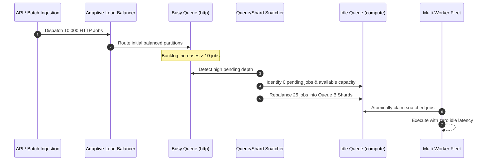

# Distributed Job Scheduler — Scheduling & Load Balancing Algorithms

This document provides an in-depth mathematical, architectural, and algorithmic specification of the scheduling, shard routing, and load balancing engines implemented in the **Distributed Job Scheduler (DJS)** platform.

---

## 1. Executive Summary & Core Philosophy

The scheduling subsystem in DJS operates on four foundational pillars:
1. **Single Authoritative Scheduler Instance**: Eliminates split-brain anomalies and election overhead.
2. **Priority + Dynamic Aging (Starvation Prevention)**: Guarantees latency-critical jobs execute first while preventing lower-priority starvation.
3. **Situation-Aware Adaptive Multi-Queue & Shard Distribution**: Dynamically balances incoming jobs across service queues and shards based on live queue depths and shard saturation.
4. **Autonomous Queue & Shard Work-Stealing / Job Snatching**: Ensures zero queue and zero shard idle time during burst surges.

---

## 2. Dynamic Priority & Aging Algorithm

### 2.1 The Starvation Problem in Strict Priority Queues
In pure priority-based scheduling, a continuous influx of high-priority jobs ($P=50$) indefinitely starves low-priority jobs ($P=10$). DJS solves this via **Dynamic Time-Decay Aging**.

### 2.2 Mathematical Formulation
Every scheduled/delayed job has a **Base Priority** $P_{\text{base}} \in [1, 100]$ and a **Wait Time** $T_{\text{wait}}$ (seconds elapsed since `scheduled_at`):

$$\text{Effective Priority} = P_{\text{base}} \times 10 + \left\lfloor \frac{\max(0, T_{\text{current}} - T_{\text{scheduled}})}{10} \right\rfloor$$

#### Example Calculation:
| Job Name | Base Priority ($P$) | Wait Time ($T_{\text{wait}}$) | Calculation | Effective Priority | Execution Rank |
| :--- | :---: | :---: | :---: | :---: | :---: |
| **Critical Webhook** | $50$ | $0\text{s}$ | $50 \times 10 + \lfloor 0 / 10 \rfloor$ | **$500$** | **#1** |
| **Batch Report** | $10$ | $600\text{s}$ (10 min) | $10 \times 10 + \lfloor 600 / 10 \rfloor$ | **$160$** | **#3** |
| **Batch Report** | $10$ | $4200\text{s}$ (70 min) | $10 \times 10 + \lfloor 4200 / 10 \rfloor$ | **$520$** | **#1 (Promoted ahead of Critical!)** |

### 2.3 Implementation Reference
Implemented in [[scheduler/src/index.js](file:///d:/Distributed%20Job%20Scheduler/distributed-job-scheduler/scheduler/src/index.js#L130-L198)]:
```sql
SELECT j.id, j.project_id, j.queue_id, j.name, j.priority, j.scheduled_at,
       (j.priority * 10 + CAST(MAX(0, (strftime('%s', ?) - strftime('%s', j.scheduled_at))) / 10 AS INTEGER)) as effective_priority
FROM jobs j
WHERE j.status = 'scheduled' AND j.scheduled_at <= ?
ORDER BY effective_priority DESC, j.scheduled_at ASC
LIMIT 50;
```

---

## 3. Situation-Aware Adaptive Multi-Queue Load Balancer

### 3.1 Architecture Overview
When high-density traffic arrives (e.g. 1,000 to 10,000 jobs in a batch or rapid HTTP ingestion), directing all traffic into a single service queue causes backpressure and queue choking.

The **Adaptive Load Balancer** ([adaptive_load_balancer.service.js](file:///d:/Distributed%20Job%20Scheduler/distributed-job-scheduler/backend/src/autoscaling/adaptive_load_balancer.service.js)) evaluates the real-time situation across all 5 service queues in the project:
* `http-service-queue` (HTTP Requests & Webhooks)
* `db-service-queue` (Database Queries & Migrations)
* `compute-service-queue` (CPU Crunching & Crypto)
* `notification-service-queue` (Alerts & Emails)
* `script-service-queue` (Custom Node Scripts)

```
                            ┌────────────────────────────────────────┐
                            │      Incoming Job Ingestion Batch      │
                            └───────────────────┬────────────────────┘
                                                │
                                                ▼
                            ┌────────────────────────────────────────┐
                            │    Dynamic Situation Score Matrix      │
                            │  Score(Q) = (P*5) - (Depth*2) - Active │
                            └───────────────────┬────────────────────┘
                                                │
                 ┌──────────────────────────────┼──────────────────────────────┐
                 ▼                              ▼                              ▼
     [http-service-queue]             [db-service-queue]            [compute-service-queue]
    Shard #0 │ Shard #1               Shard #0 │ Shard #1             Shard #0 │ Shard #1
```

### 3.2 Dynamic Situation Score Matrix
The scheduler evaluates candidate queues using the following objective function:

$$\text{Score}(Q) = (Q.\text{priority} \times 5) - (Q.\text{pending\_depth} \times 2) - Q.\text{running\_jobs}$$

* If the primary service queue has **normal load** ($\text{depth} \le 12$), jobs are routed directly to the primary service queue.
* If the primary service queue is **congested** ($\text{depth} > 12$) or receiving a batch ($N > 5$), incoming jobs are interleaved across all active queues and their active shards.

---

## 4. Shard Partitioning & Least-Loaded Routing

### 4.1 Partition Architecture
Each logical queue owns between **2 baseline shards** and **16 dynamic shards**. Shards act as isolated sub-queues with atomic concurrency controls.

### 4.2 Routing Strategies ([shard_router.service.js](file:///d:/Distributed%20Job%20Scheduler/distributed-job-scheduler/backend/src/autoscaling/shard_router.service.js))
1. **Least-Loaded Shard Routing (Default)**:
   Routes jobs to the shard partition with the lowest number of `queued` records:
   $$\text{Target Shard} = \arg\min_{s \in \text{Shards}(Q)} (\text{Count}_{\text{queued}}(s))$$
2. **Consistent Affinity Sharding**:
   When an `idempotencyKey` or `affinityKey` is supplied (e.g., customer account ID), routes deterministic hashing to preserve partition affinity:
   $$\text{Shard Index} = \text{MurmurHash3}(\text{affinityKey}) \pmod{|\text{Active Shards}|}$$

---

## 5. Autonomous Queue & Shard Work-Stealing / Job Snatching

### 5.1 The Imbalance Problem
If `http-service-queue` receives 10,000 tasks and `compute-service-queue` has 0 tasks, workers dedicated to `compute-service-queue` would otherwise sit idle while `http-service-queue` experiences high latency.

### 5.2 Two-Tier Snatching Engine ([queue_shard_snatcher.service.js](file:///d:/Distributed%20Job%20Scheduler/distributed-job-scheduler/backend/src/autoscaling/queue_shard_snatcher.service.js))

#### Tier 1: Cross-Shard Snatching
* If $\max(\text{Shard Load}) - \min(\text{Shard Load}) > 4$:
* The idle shard snatches up to $\min(\lfloor \Delta / 2 \rfloor, 50)$ pending jobs from the overloaded shard partition.

#### Tier 2: Cross-Queue Absorption
* If a queue has $> 10$ pending jobs and an alternative queue in the same project has $0$ pending jobs:
* The idle queue immediately absorbs up to 25 pending jobs into its own processing lanes.



---

## 6. Worker Multi-Concurrency Atomic Claim

### 6.1 Atomic Claim Protocol ([worker.js](file:///d:/Distributed%20Job%20Scheduler/distributed-job-scheduler/worker/src/worker.js#L260-L325))
To guarantee zero duplicate executions across concurrent worker processes without external locks:

```sql
UPDATE jobs
SET status = 'claimed',
    worker_id = ?,
    updated_at = ?
WHERE id = (
  SELECT id FROM jobs
  WHERE queue_id = ? AND status = 'queued'
  ORDER BY priority DESC, created_at ASC
  LIMIT 1
);
```

* SQLite WAL mode ensures non-blocking concurrent readers while serialization ensures strictly **one worker succeeds per claimed job**.
* In-flight jobs are bounded by the worker's `concurrencyController` (`activeCount < concurrencyLimit`).

---

## 7. Workflow Dependencies (DAG Engine)

### 7.1 Deterministic Dependency Propagation
* DAG workflows are expressed as nodes and directed edges in `workflow_dependencies`.
* Downstream child tasks start in status `scheduled`.
* When an upstream parent job transitions to `completed` (`on_success`) or `failed` (`on_failure`):
  1. The engine checks if all parent constraints are satisfied:
     ```sql
     SELECT COUNT(*) as remaining_blockers
     FROM workflow_dependencies wd
     JOIN jobs parent ON wd.parent_job_id = parent.id
     WHERE wd.child_job_id = ? AND (
       (wd.condition = 'on_success' AND parent.status != 'completed') OR
       (wd.condition = 'on_failure' AND parent.status != 'failed')
     );
     ```
  2. If `remaining_blockers === 0`, the child job is instantly promoted to `queued` and routed to its optimal service queue and shard partition.
